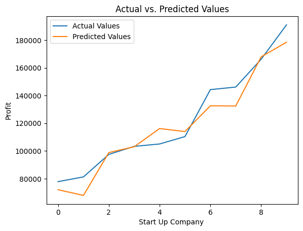

## Portfolio of Projects

---

### Preprocessing
 
Using Feature Scaling and One Hot Encoding to preprocess Data to be used in Machine Learning Model.   
 

---
### Multiple Linear Regression Model

<table style="width: 100%;">
    <tr>
        <td style="padding-right: 20px; width: 40%;">
            

                Multiple Linear Regression model trained to understand the relationship between R&D Spend,
                Administration, Marketing Spend, State and Profit of 50 Start Up companies. This model is for the use of
                VC Funders to determine which start-up company to invest in.
            

             
            
        </td>
        <td style="text-align: right; width: 60%;">
            
        </td>
    </tr>
</table>

---
### Publications

- [Can Chatbots become Human-Like?](https://www.lancashirecyberfoundry.co.uk/wp-content/uploads/2023/06/HumanLikeChatbots_WEB.pdf)
- [The Rise of AI Chatbots](https://www.lancaster.ac.uk/media/lancaster-university/content-assets/documents/cyber-foundry/lcf-articles/LCFArticle-Alina-RiseOfAIChatbots_WEB.pdf)

---
### Machine Learning Model Projects

- [Polynomial Regression Model](http://example.com/)
- [Project 2 Title](http://example.com/)
- [Project 3 Title](http://example.com/)
- [Project 4 Title](http://example.com/)
- [Project 5 Title](http://example.com/)

---
### Data Analysis Projects

- [Project 1 Title]([http://example.com/](https://colab.research.google.com/github/Alinabutt/Alinabutt.github.io/blob/main/Multiple_Linear_Regression.ipynb))
- [Project 2 Title](http://example.com/)
- [Project 3 Title](http://example.com/)
- [Project 4 Title](http://example.com/)
- [Project 5 Title](http://example.com/)

---

---

Page template forked from <a href="https://github.com/evanca/quick-portfolio">evanca</a>

<!-- Remove above link if you don't want to attibute -->
